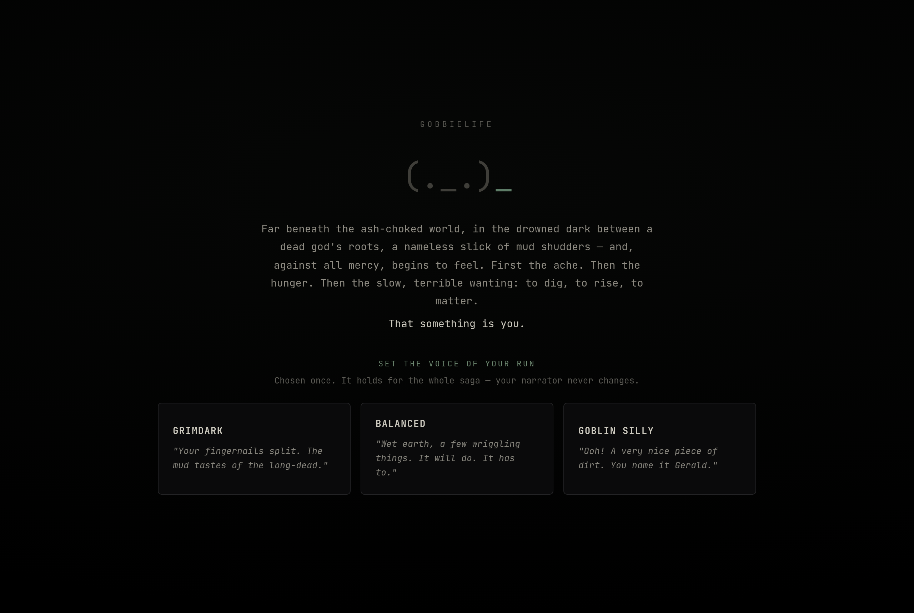
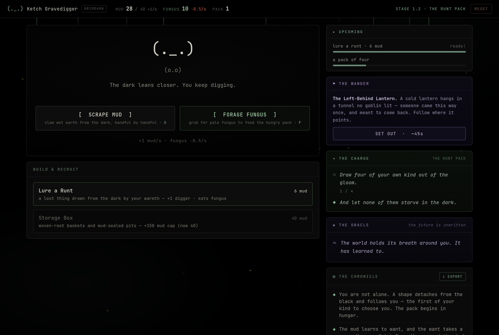

# GobbieLife

A **Candy Box–style ASCII incremental game** rendered in a pure-black terminal aesthetic.
You play a sentient slick of mud that becomes a goblin, then a warren, then a world-spanning
empire — across **three Eras / nine stages**, ending in one of **six fates**.

It is narrative-driven: a hidden-alignment system, an Oracle that whispers riddles, a branching
event engine, a parallel quest chain (*The Wander*), a Hollow-worshipping cult (*The Chorus of
the Open Door*), four-faction diplomacy, and a fully seeded Era-III hex world map. The full arc
is a deliberate ~7–8 hour real-time run.





## Play it

**No build step, no bundler, no server framework** — but it must be served over HTTP (the runtime
re-reads the page for hot-reload, which `file://` blocks). Any static server works:

```bash
# from the repo root
python3 -m http.server 8000
# then open http://localhost:8000/
```

Or with Node:

```bash
npx serve .
```

The game is **fully self-contained** — React, ReactDOM, Babel and the JetBrains Mono font are all
vendored locally (see [`vendor/`](vendor/) and [`fonts/`](fonts/)), so it runs with **zero external
network requests** and works offline. It is also a small PWA (installable, offline-cached via
[`sw.js`](sw.js)).

State autosaves to `localStorage`:

- `gobbielife_slice_v1` — the save (throttled to ≤ every 5s, plus on stage-up / ending / tab-close).
- `gobbielife_fate_v1` — the last ending, for New-Game+ keepsakes and the opening Oracle riddle.

### Deploying on GitHub Pages

Because everything is static and self-contained, enable **Settings → Pages → Deploy from branch**
and the game is live at your Pages URL — no configuration needed.

## What's in the box

| Path | What it is |
|---|---|
| [`index.html`](index.html) | **The game.** The whole Era I → III arc; every system lives here. |
| [`support.js`](support.js) | The Design Component runtime (mounts the template + logic class). |
| [`vendor/`](vendor/) | Vendored React 18.3.1, ReactDOM 18.3.1, and Babel Standalone 7.29.0 (UMD). |
| [`fonts/`](fonts/) | Self-hosted JetBrains Mono (OFL-1.1). |
| [`assets/panorama/`](assets/panorama/) | The 7-tier procedural settlement-skyline silhouettes. |
| [`manifest.json`](manifest.json) · [`sw.js`](sw.js) | PWA manifest + offline service worker. |
| [`docs/`](docs/) | Design docs — the Design Bible, architecture diagram, nav-options study, and the project brief. |
| [`screenshots/`](screenshots/) | Captures of the running game. |

### The design docs ([`docs/`](docs/))

- **[`PROJECT_BRIEF.md`](docs/PROJECT_BRIEF.md)** — the canonical brief: resource/economy summary,
  locked design decisions, and every implemented system. **Start here.**
- **[`HANDOFF.md`](docs/HANDOFF.md)** — the original handoff overview.
- **[`GobbieLife Design Bible.dc.html`](docs/GobbieLife%20Design%20Bible.dc.html)** — the living
  design doc: pillars, world, cast, factions, the narrative engine, the panorama, building catalog,
  pacing, and the fate map. Read for intent.
- **[`GobbieLife Architecture.dc.html`](docs/GobbieLife%20Architecture.dc.html)** — the engine's
  system-architecture diagram.
- **[`GobbieLife Nav Options.dc.html`](docs/GobbieLife%20Nav%20Options.dc.html)** — the nav-style
  decision mockup (the panel-filter option won and is built).
- **[`OPTIMIZATION_PLAN.md`](docs/OPTIMIZATION_PLAN.md)** · **[`BUG_REVIEW.md`](docs/BUG_REVIEW.md)**
  · **[`IMPROVEMENT_PLAN.md`](docs/IMPROVEMENT_PLAN.md)** — performance notes, known issues, backlog.

## How it works

`index.html` is a **Design Component** (`.dc.html`): a single file holding an inline-styled HTML
template inside `<x-dc>…</x-dc>` plus a framework-agnostic `class Component extends DCLogic` logic
class in a `<script type="text/x-dc">` block. [`support.js`](support.js) is the small runtime that
parses that document, transpiles the logic class with Babel, and mounts it with React.

The logic class is **reducer-shaped and portable**: a flat serialisable `state` object, pure
`_eraI / _eraII / _eraIII(s)` tick functions returning state patches, and a `renderVals()`
view-model whose every value is consumed by the template by name. The game loop is a **1 Hz
`setInterval`**; passive production accrues per tick and the whole per-second sim runs in one
batched `setState`.

### A note on `support.js` and `vendor/`

`support.js` is generated runtime code. The only change made here versus the original handoff is
that its three CDN `<script>` URLs (React, ReactDOM, Babel — originally loaded from `unpkg.com`)
now point at the local copies in [`vendor/`](vendor/), and the matching Subresource-Integrity
hashes were cleared (SRI does not apply to same-origin files). This makes the game fully
self-contained and reproducible. Likewise, the Google Fonts `<link>` in `index.html` was replaced
with the self-hosted [`fonts/jetbrains-mono.css`](fonts/jetbrains-mono.css). No game logic was
touched.

## Credits & licenses

- Game design, narrative, and implementation: the GobbieLife design handoff (see [`docs/`](docs/)).
- [React](https://react.dev/) and [ReactDOM](https://react.dev/) — MIT.
- [Babel Standalone](https://babeljs.io/) — MIT.
- [JetBrains Mono](https://www.jetbrains.com/lp/mono/) — SIL Open Font License 1.1.
